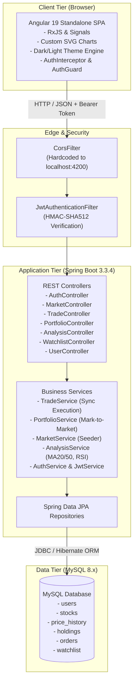
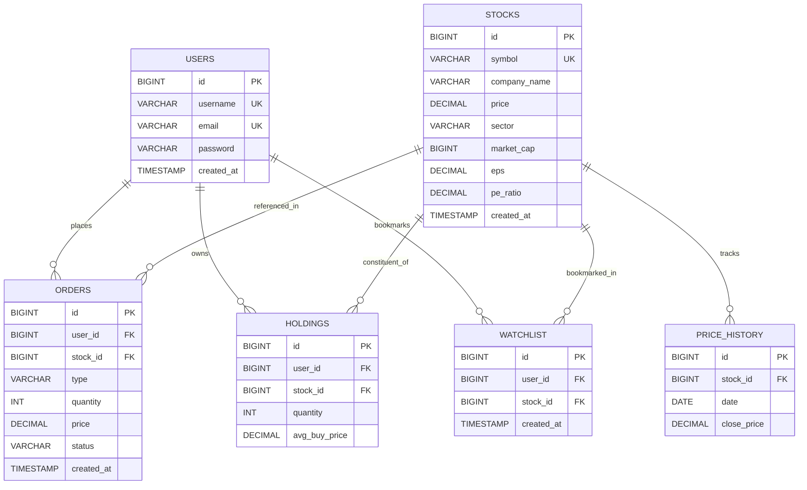
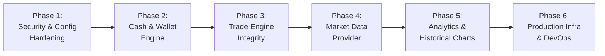

# PortfolioPro — Production-Readiness Technical Audit & Architecture Roadmap

**Audit Date**: September 29, 2026  
**Auditor**: Senior Software Architect / Antigravity AI  
**Scope**: Full Stack (Angular 19 SPA, Spring Boot 3.3.4 REST API, MySQL 8.x Database, Infrastructure)  
**Objective**: Comprehensive analysis of prototype architecture, simulated components, security vulnerabilities, deployment bottlenecks, and phased roadmap to production readiness.

---

## Executive Summary

PortfolioPro is an exceptionally well-structured MVP with clean separation of concerns, high code readability, modern Angular 19 signals/standalone components, Spring Security 6 stateless JWT authentication, and relational data modeling.

However, PortfolioPro is currently a **closed-world deterministic simulator**. Key enterprise trading capabilities—real-time market data ingestion, cash balance accounting, server-validated order pricing, concurrency control, token lifecycle management, and production environment configurability—are either simulated or absent. 

Deploying the current codebase directly to production will result in immediate operational failures (e.g., frontend hardcoded to `http://localhost:8080/api`, CORS rejecting production origins, arbitrary client price injection, and unlimited buying power).

---

## 1. Current Architecture



### Component Breakdown

| Tier | Technology | Current Implementation | Production Requirement |
|---|---|---|---|
| **Frontend** | Angular 19, TypeScript 5.5, CSS3 | Single-page application using standalone components, Reactive Forms, custom SVG charting, and dynamic CSS theme variables. | Multi-environment build pipeline, CDN hosting, automated chunking, real-time WebSocket quotes. |
| **Backend** | Spring Boot 3.3.4, Java 17+ | Modular REST API with Spring Data JPA, Hibernate, Bean Validation, and Spring Security 6. | Distributed architecture, Redis caching, event-driven trading pipeline, asynchronous execution. |
| **Database** | MySQL 8.0 | 6 relational tables with foreign keys and unique constraints. DDL mode set to `hibernate.ddl-auto=update`. | Managed RDBMS (AWS RDS / GCP Cloud SQL), Liquibase/Flyway migrations, read replicas, connection pooling. |
| **Security** | Spring Security 6, JJWT 0.12.6 | Stateless JWT (HMAC-SHA, 24h validity), BCrypt (10 rounds). Tokens stored in `localStorage`. | Refresh token rotation, HttpOnly SameSite cookies, CSRF protection, RBAC, OAuth2/OIDC, Rate limiting. |
| **Containerization** | Docker & Docker Compose | Basic 3-service compose (`mysql`, `backend`, `frontend`). | Multi-stage production Dockerfiles, non-root users, Kubernetes manifests / Helm charts, Secret managers. |

---

## 2. Existing Functionality

The following features are fully implemented, verified, and operational within the prototype:

1. **Authentication & Session**:
   - User registration (`POST /api/auth/register`) with username/email uniqueness validation and BCrypt password encryption.
   - User login (`POST /api/auth/login`) returning JWT token and username.
   - Route protection via Angular `AuthGuard` and automated header injection via `AuthInterceptor`.
   - User profile endpoint (`GET /api/users/profile`).

2. **Market Catalog & Watchlist**:
   - Stock listing (`GET /api/stocks`) returning 8 equities with static fundamental indicators.
   - Individual stock detail (`GET /api/stocks/{symbol}`) with dynamic watchlist bookmark status.
   - User watchlist management (`GET`, `POST`, `DELETE /api/watchlist/{stockId}`) backed by relational unique constraint `(user_id, stock_id)`.

3. **Simulated Trading Engine**:
   - Order placement (`POST /api/orders`) supporting `BUY` and `SELL`.
   - Holding calculation: automatic weighted average cost basis on repeat buys:
     $$\text{AvgPrice}_{\text{new}} = \frac{(\text{Qty}_{\text{old}} \times \text{Avg}_{\text{old}}) + (\text{Qty}_{\text{new}} \times \text{Price}_{\text{new}})}{\text{Qty}_{\text{old}} + \text{Qty}_{\text{new}}}$$
   - Position reduction or complete holding record deletion on liquidation.
   - Short-selling protection: rejects sales exceeding currently held share quantity.
   - Transaction ledger (`GET /api/orders`) recording chronological audit trail of all executed trades.

4. **Portfolio Analytics & Mark-to-Market**:
   - Portfolio overview (`GET /api/portfolio`): computes current market valuation, total invested cost basis, dollar profit/loss ($), and percentage return (%).
   - Portfolio summary (`GET /api/portfolio/summary`): lightweight metric payload for dashboard stat cards.
   - Asset allocation (`GET /api/portfolio/analytics`): relative holding percentages, concentration risk indicator, and diversification tier.

5. **Technical & Fundamental Analysis**:
   - Mathematical calculation of 20-day Simple Moving Average (MA20), 50-day Simple Moving Average (MA50), and 14-period Relative Strength Index (RSI-14) using Wilder's smoothing method.
   - Client-side interactive SVG price chart with crosshair tooltips and moving average overlays.

6. **UI & Theme System**:
   - Responsive fintech UI with dark navy/charcoal styling and high-contrast light mode.
   - Animated SVG theme switcher with persistent user preference storage.
   - Custom geometric startup branding.

---

## 3. Mock & Demo Components Audit

### 3.1 Hardcoded, Simulated, and Mock Data

| Component | Nature of Simulation | File Location | Production Gap |
|---|---|---|---|
| **Stock Catalog** | Exactly 8 fixed equities (AAPL, MSFT, GOOGL, AMZN, TSLA, NVDA, JPM, META). | `backend/src/main/java/com/portfoliopro/service/MarketService.java:96` and `database/seed.sql:14` | Real markets trade thousands of tickers, ETFs, mutual funds, and crypto assets. |
| **Stock Prices** | Static numbers in `stocks.price` column (e.g. AAPL is permanently \$225.50). | `database/seed.sql:15` | Stock prices do not fluctuate, tick, or reflect live market trades. |
| **Historical Price Data** | 60-day price history generated via mathematical sine wave formula: `Math.sin(i * 0.3) * 0.03 - ...` | `backend/src/main/java/com/portfoliopro/service/MarketService.java:124` | Historical chart data is synthetically fabricated rather than actual exchange quotes. |
| **Fundamental Indicators** | Static P/E, EPS, and Market Cap values entered during initial seeding. | `database/seed.sql:15` | Quarterly earnings, PE ratios, and market caps are never updated or adjusted. |
| **Order Execution Price** | Client passes execution price in `request.getPrice()`. | `backend/src/main/java/com/portfoliopro/service/TradeService.java:64` | The client dictates the trade execution price rather than the market exchange. |
| **Cash Account & Buying Power** | Infinite buying power; no user balance exists. | `backend/src/main/java/com/portfoliopro/entity/User.java` | Users can purchase millions of dollars of stock with zero account balance. |
| **Diversification & Risk Rating** | Categorized strictly by count of holdings ($1 \rightarrow$ High Risk, $>3 \rightarrow$ Higher Diversification). | `backend/src/main/java/com/portfoliopro/service/PortfolioService.java:130` | Lacks standard portfolio variance, covariance matrix, Beta, Sharpe ratio, or Value at Risk (VaR). |
| **Demo User Credentials** | Seeded user `demo` / `demo123` with pre-computed BCrypt hash. | `database/seed.sql:9` | Demo credentials present in production database scripts. |

### 3.2 Frontend Pages Dependency on Mock/Simulated Data

| Frontend Page | Depends on Simulated Data? | Nature of Dependency |
|---|---|---|
| **Dashboard** (`/dashboard`) | **YES** | Top holdings, market leaders, and recent orders all depend on the 8 static seeded stocks and simulated orders. |
| **Market Directory** (`/market`) | **YES** | Displays only the 8 seeded companies; client-side search/sector filtering only operates on this 8-item array. |
| **Stock Details** (`/market/{symbol}`) | **YES** | Quotes and 60-day charts are rendered from the synthetic sine-wave historical data. |
| **Technical & Fundamental Analysis** (`/analysis`) | **YES** | MA20, MA50, and RSI-14 indicators are calculated on mathematically generated historical data. |
| **Portfolio Management** (`/portfolio`) | **YES** | P/L and valuations are calculated against static stock prices with zero cash accounting. |
| **Order History** (`/orders`) | **YES** | Displays simulated instant-fill orders with client-submitted execution prices. |
| **Trade Modal** (`app-trade-form`) | **YES** | Submits current static quote price from frontend to backend without server-side validation. |

---

## 4. Missing Functionality & Gaps for Production

### 4.1 Missing REST APIs

```
Current Implemented Endpoints: 13
Required Production Endpoints: 32+
```

| Domain | Missing Endpoint | Method | Purpose |
|---|---|---|---|
| **Wallet / Cash** | `/api/account/balance` | `GET` | Retrieve cash balance, buying power, unsettled cash, and currency. |
| **Wallet / Cash** | `/api/account/deposit` | `POST` | Deposit simulated funds or process ACH/Stripe payment gateway. |
| **Wallet / Cash** | `/api/account/withdraw` | `POST` | Withdraw cash balance with settlement checks. |
| **Wallet / Cash** | `/api/account/transactions` | `GET` | Cash ledger history (deposits, withdrawals, dividend credits, trade settlements). |
| **Market Data** | `/api/stocks/search?q={query}` | `GET` | Server-side ticker & company search across global equity universes. |
| **Market Data** | `/api/stocks/{symbol}/quote` | `GET` | Real-time quote (Bid, Ask, Spread, Day High, Day Low, Volume, Open, Prev Close). |
| **Market Data** | `/api/stocks/{symbol}/candles` | `GET` | Real OHLCV historical candlestick data across timeframe resolutions (`1m`, `5m`, `1h`, `1d`, `1w`). |
| **Market Data** | `/api/market/status` | `GET` | Exchange operating status (Open, Closed, Pre-market, After-hours, Holiday calendar). |
| **Trading Engine** | `/api/orders` (Extended) | `POST` | Support `orderType`: `MARKET`, `LIMIT`, `STOP_LOSS`, `STOP_LIMIT`, `timeInForce` (`GTC`, `DAY`). |
| **Trading Engine** | `/api/orders/{id}/cancel` | `POST` | Cancel unfilled pending limit/stop orders. |
| **Portfolio** | `/api/portfolio/history?range={range}` | `GET` | Historical portfolio equity curve (daily NAV) for portfolio performance charting. |
| **Portfolio** | `/api/portfolio/realized-pnl` | `GET` | Realized capital gains/losses audit for tax reporting. |
| **User & Auth** | `/api/auth/refresh-token` | `POST` | Exchange refresh token for fresh access token without re-login. |
| **User & Auth** | `/api/auth/forgot-password` | `POST` | Request password reset token via email. |
| **User & Auth** | `/api/auth/reset-password` | `POST` | Execute password reset with secure cryptographic token. |
| **User & Auth** | `/api/users/change-password` | `PUT` | Authenticated password update requiring current password verification. |
| **User & Auth** | `/api/users/profile` | `PUT` | Update user display name, phone, notification preferences. |
| **Admin** | `/api/admin/users` | `GET` | Backoffice user management and account locking. |

### 4.2 Missing Backend Services & Architectural Components

1. **Market Data Provider Integration**:
   - Integration with a live financial data provider (e.g., Polygon.io, Finnhub, Alpha Vantage, Alpaca Markets, or IEX Cloud).
   - Ingestion worker / scheduled cron to ingest daily EOD close prices and corporate actions.
   - Redis cache layer for live ticker quotes with 1-5 second TTL to protect external API rate limits.
2. **Double-Entry Cash & Ledger Service**:
   - Cash balance management ensuring:
     $$\text{Total Equity} = \text{Cash Balance} + \sum (\text{Holding Quantity} \times \text{Current Market Price})$$
   - Debiting cash upon BUY execution; crediting cash upon SELL execution.
   - Overdraft protection preventing trade execution when $\text{Order Value} > \text{Available Buying Power}$.
3. **Asynchronous Order Matching & Execution Engine**:
   - Separation of order submission from order execution.
   - Market hours enforcement (reject or queue market orders when exchanges are closed).
   - Limit order book matching engine or simulated execution against real bid/ask quotes.
4. **Real-Time WebSocket Streaming (`/ws/market`)**:
   - STOMP/WebSocket broker to stream price ticks and execution notifications to active browser clients without polling.
5. **Portfolio Snapshot Scheduler**:
   - Nightly Spring Batch / Quartz job recording end-of-day equity values for every user into `portfolio_snapshots`.

---

## 5. Security Vulnerabilities & Exposure Audit

### 🚨 Critical Vulnerability 1: Client-Controlled Order Execution Price
- **Vulnerability**: In `TradeService.java:64`, the backend accepts `request.getPrice()` directly from the incoming HTTP payload and uses it as the execution price:
  ```java
  // In TradeService.java:
  if ("BUY".equals(orderType)) {
      executeBuyOrder(user, stock, request.getQuantity(), request.getPrice());
  }
  ```
- **Exploit Scenario**: An attacker issues `POST /api/orders` with body:
  ```json
  {"stockId": 1, "type": "BUY", "quantity": 10000, "price": 0.01}
  ```
  The system will execute the purchase of 10,000 Apple shares (\$2.25M value) for \$100.00.
- **Remediation**: Remove `price` from `OrderRequest` entirely for market orders. Fetch current price exclusively from the server-side market service/cache. For limit orders, store client price as `limitPrice` and execute only when market quote satisfies limit conditions.

---

### 🚨 Critical Vulnerability 2: Unlimited Purchasing Power (No Cash Balance Verification)
- **Vulnerability**: Neither `User` nor `Holding` tracks liquid funds. `TradeService` performs zero buying power checks.
- **Exploit Scenario**: Any registered user can execute unlimited BUY orders for arbitrary share quantities, completely breaking portfolio integrity and system metrics.
- **Remediation**: Implement a `wallets` entity with `cash_balance`, `available_balance`, and `currency`. Verify:
  $$\text{orderTotal} \le \text{wallet.getAvailableBalance()}$$
  Deduct funds atomically within the database transaction.

---

### 🚨 Critical Vulnerability 3: Hardcoded JWT Secret Committed to Repository
- **Vulnerability**: In `backend/src/main/resources/application.properties:18` and `docker-compose.yml:30`:
  ```properties
  app.jwt.secret=${JWT_SECRET:404E635266556A586E3272357538782F413F4428472B4B6250645367566B5970}
  ```
  This HMAC-SHA key is publicly committed in Git.
- **Exploit Scenario**: Any attacker can use this key to forge valid JWT tokens for any username (including `admin` or other users) and completely bypass authentication without knowing passwords.
- **Remediation**: Remove default fallback secret. Enforce application startup failure if `JWT_SECRET` environment variable is not supplied. Store secrets in AWS Secrets Manager, HashiCorp Vault, or Kubernetes Secrets.

---

### 🚨 Critical Vulnerability 4: Race Conditions & Concurrent Order Execution
- **Vulnerability**: `Holding` entity has no `@Version` (optimistic locking) and `TradeService` does not use `SELECT ... FOR UPDATE` (pessimistic locking).
- **Exploit Scenario**: If a user submits two simultaneous `SELL` requests for 10 shares when they only own 10 shares, both requests can pass the quantity check before either transaction commits, resulting in selling 20 shares (unauthorized short position or negative quantities).
- **Remediation**: Add `@Version private Long version;` to `Holding` or use `holdingRepository.findByUserAndStockForUpdate(...)` with `LockModeType.PESSIMISTIC_WRITE`.

---

### ⚠️ High Vulnerability 5: Unauthenticated Public Endpoints
- **Vulnerability**: In `SecurityConfig.java:66`:
  ```java
  .requestMatchers("/api/auth/**", "/api/health/**", "/api/stocks/**", "/api/analysis/**").permitAll()
  ```
  All stock details and technical analysis endpoints are open to the public Internet without rate limiting or authentication.
- **Remediation**: Restrict `/api/stocks/**` and `/api/analysis/**` to authenticated users (`.authenticated()`), or implement strict rate limiting via Bucket4j / Spring Cloud Gateway.

---

### ⚠️ High Vulnerability 6: Token Storage in LocalStorage & No Token Revocation
- **Vulnerability**: JWT tokens are stored in `window.localStorage` in `auth.service.ts:28`. Any Cross-Site Scripting (XSS) vulnerability allows immediate token exfiltration. Furthermore, `onLogout()` only clears the client storage; the token remains cryptographically valid on the server for 24 hours.
- **Remediation**: Migrate to HttpOnly, Secure, SameSite cookies. Implement a Redis token blocklist or use short-lived access tokens (15 minutes) with rotating refresh tokens.

---

### ⚠️ Medium Vulnerability 7: SQL Query and Parameter Exposure in Production Logs
- **Vulnerability**: In `application.properties`:
  ```properties
  spring.jpa.show-sql=true
  spring.jpa.properties.hibernate.format_sql=true
  ```
  All SQL queries with parameter binds will print to standard output in production, cluttering log aggregators and leaking sensitive user identifiers.
- **Remediation**: Set `spring.jpa.show-sql=false` for production profiles.

---

## 6. Production Deployment Risks & Blockers

1. **Frontend Production Build Hardcoded to Localhost**:
   - `frontend/src/environments/environment.ts`:
     ```typescript
     export const environment = {
       production: true,
       apiUrl: 'http://localhost:8080/api'
     };
     ```
   - **Production Impact**: When deployed to a public domain (e.g. `https://app.portfoliopro.com`), the client bundle will attempt to fetch data from the end-user's local machine (`http://localhost:8080`), resulting in total application failure (`ERR_CONNECTION_REFUSED`).
   - **Fix**: Use relative API URL `apiUrl: '/api'` behind an Nginx reverse proxy, or inject environment domain via build configuration.

2. **CORS Rejection of Production Domains**:
   - `backend/src/main/java/com/portfoliopro/config/CorsConfig.java:19`:
     ```java
     config.setAllowedOrigins(List.of("http://localhost:4200", "http://127.0.0.1:4200"));
     ```
   - **Production Impact**: Every HTTP request originating from any domain other than `localhost:4200` will be blocked by Spring Security CORS filter.
   - **Fix**: Externalize allowed origins to environment variable: `${CORS_ALLOWED_ORIGINS:http://localhost:4200}`.

3. **Unsafe Database DDL Configuration (`ddl-auto=update`)**:
   - `application.properties:12` uses `spring.jpa.hibernate.ddl-auto=update`.
   - **Production Impact**: In multi-instance or Kubernetes cluster deployments, multiple backend pods starting simultaneously will attempt concurrent schema alterations, leading to schema corruption, deadlocks, and table locks. Hibernate can alter columns but cannot safely handle rollbacks, column drops, or complex migrations.
   - **Fix**: Set `ddl-auto=validate` in production and manage schema evolution strictly through Liquibase or Flyway.

4. **Default Blank Database Password**:
   - `application.properties:8` defaults to `spring.datasource.password=${SPRING_DATASOURCE_PASSWORD:}` (empty string).
   - **Production Impact**: Unsafe defaults create high risk of deploying services with unauthenticated database access.

5. **Missing Database Connection Pool (HikariCP) Configuration**:
   - Default pool limits are unconfigured. Under moderate concurrency (e.g., 50+ simultaneous traders), the connection pool will exhaust, leading to HTTP 500 errors and database connection timeouts.
   - **Fix**: Explicitly configure HikariCP: `maximum-pool-size=20`, `minimum-idle=5`, `connection-timeout=30000`, `idle-timeout=600000`.

6. **Docker Compose Missing Reverse Proxy Routing**:
   - In `docker-compose.yml`, the frontend container runs Nginx on port 4200, and backend runs on 8080.
   - **Production Impact**: In production cloud environments (AWS ECS, GCP Cloud Run, DigitalOcean), frontend and backend must be unified behind a single domain/port via an Nginx reverse proxy or Ingress controller to avoid exposing internal port 8080.

---

## 7. Database Schema & Relational Model



### Proposed Schema Additions for Production

```sql
-- 1. User Wallets / Cash Ledger (Essential for Real Trading)
CREATE TABLE IF NOT EXISTS user_wallets (
    id BIGINT AUTO_INCREMENT PRIMARY KEY,
    user_id BIGINT NOT NULL UNIQUE,
    cash_balance DECIMAL(15, 2) NOT NULL DEFAULT 100000.00, -- Default $100k simulated starter cash
    reserved_balance DECIMAL(15, 2) NOT NULL DEFAULT 0.00,  -- Funds locked in pending limit orders
    currency VARCHAR(3) NOT NULL DEFAULT 'USD',
    updated_at TIMESTAMP DEFAULT CURRENT_TIMESTAMP ON UPDATE CURRENT_TIMESTAMP,
    CONSTRAINT fk_wallet_user FOREIGN KEY (user_id) REFERENCES users(id) ON DELETE CASCADE
);

-- 2. Daily Portfolio Performance Snapshots (For Historical Growth Chart)
CREATE TABLE IF NOT EXISTS portfolio_snapshots (
    id BIGINT AUTO_INCREMENT PRIMARY KEY,
    user_id BIGINT NOT NULL,
    snapshot_date DATE NOT NULL,
    cash_balance DECIMAL(15, 2) NOT NULL,
    invested_value DECIMAL(15, 2) NOT NULL,
    total_equity DECIMAL(15, 2) NOT NULL,
    daily_pnl DECIMAL(15, 2) NOT NULL,
    daily_pnl_percent DECIMAL(8, 4) NOT NULL,
    CONSTRAINT fk_snapshot_user FOREIGN KEY (user_id) REFERENCES users(id) ON DELETE CASCADE,
    CONSTRAINT uq_user_snapshot_date UNIQUE (user_id, snapshot_date)
);

-- 3. Intraday Candlestick History (Real Market Charts)
CREATE TABLE IF NOT EXISTS stock_candles (
    id BIGINT AUTO_INCREMENT PRIMARY KEY,
    stock_id BIGINT NOT NULL,
    resolution VARCHAR(5) NOT NULL, -- 1m, 5m, 1h, 1d
    timestamp TIMESTAMP NOT NULL,
    open_price DECIMAL(12, 2) NOT NULL,
    high_price DECIMAL(12, 2) NOT NULL,
    low_price DECIMAL(12, 2) NOT NULL,
    close_price DECIMAL(12, 2) NOT NULL,
    volume BIGINT NOT NULL,
    CONSTRAINT fk_candles_stock FOREIGN KEY (stock_id) REFERENCES stocks(id) ON DELETE CASCADE,
    CONSTRAINT uq_stock_candle UNIQUE (stock_id, resolution, timestamp)
);

-- 4. User Refresh Tokens (Secure Session Management)
CREATE TABLE IF NOT EXISTS refresh_tokens (
    id BIGINT AUTO_INCREMENT PRIMARY KEY,
    user_id BIGINT NOT NULL,
    token_hash VARCHAR(255) NOT NULL UNIQUE,
    expires_at TIMESTAMP NOT NULL,
    created_at TIMESTAMP DEFAULT CURRENT_TIMESTAMP,
    revoked BOOLEAN NOT NULL DEFAULT FALSE,
    CONSTRAINT fk_refresh_token_user FOREIGN KEY (user_id) REFERENCES users(id) ON DELETE CASCADE
);
```

---

## 8. Detailed Audit Answers to the 10 Core Questions

### Q1: Which data is currently hardcoded/mock/simulated?
- **8 Stocks**: AAPL, MSFT, GOOGL, AMZN, TSLA, NVDA, JPM, META with static prices, market caps, P/E, EPS, and sectors.
- **60-day historical prices**: Mathematically generated using a trigonometric formula (`Math.sin(...)`).
- **Order prices**: Sent directly by the client browser during trade placement.
- **User cash**: Unlimited / non-existent (no wallet accounting).
- **Risk & Diversification**: Labels ("Low", "Moderate", "Higher") derived purely from counting unique holdings (0, 1, 2-3, >3).

### Q2: Which frontend pages depend on mock data?
- Every page (`Dashboard`, `Market`, `Stock Details`, `Analysis`, `Portfolio`, `Orders`, `Trade Form`) displays simulated data because the underlying backend endpoints serve static or mathematically synthesized datasets.

### Q3: Which backend APIs already exist?
- **13 endpoints**:
  1. `POST /api/auth/register`
  2. `POST /api/auth/login`
  3. `GET /api/users/profile`
  4. `GET /api/stocks`
  5. `GET /api/stocks/{symbol}`
  6. `GET /api/watchlist`
  7. `POST /api/watchlist/{stockId}`
  8. `DELETE /api/watchlist/{stockId}`
  9. `POST /api/orders`
  10. `GET /api/orders`
  11. `GET /api/portfolio`
  12. `GET /api/portfolio/summary`
  13. `GET /api/portfolio/analytics`
  14. `GET /api/analysis/technical/{symbol}`
  15. `GET /api/analysis/fundamental/{symbol}`
  16. `GET /api/health`

### Q4: Which APIs are missing?
- Wallet & Cash APIs (`/api/account/balance`, `/api/account/deposit`, `/api/account/withdraw`).
- Live quote & search APIs (`/api/stocks/search`, `/api/stocks/{symbol}/quote`, `/api/stocks/{symbol}/candles`).
- Portfolio equity curve history (`/api/portfolio/history`).
- Realized gains/loss audit (`/api/portfolio/realized-pnl`).
- Order management (`/api/orders/{id}/cancel`, Limit/Stop orders).
- Password recovery & session refresh (`/api/auth/refresh-token`, `/api/auth/forgot-password`, `/api/auth/reset-password`).
- WebSocket live streaming (`/ws/market`).

### Q5: How BUY/SELL currently works?
- Client clicks Buy/Sell in the modal.
- Client passes `{ stockId, type, quantity, price: currentPrice }` to `POST /api/orders`.
- Backend verifies `quantity > 0` and stock existence.
- Backend executes trade at client-provided `price`.
- No cash balance is verified or deducted.
- For repeat `BUY`, `holdings.avgBuyPrice` is recalculated using weighted average.
- For `SELL`, checks if user owns sufficient shares; deletes or updates holding.
- No cash balance is credited upon sale.
- Order is saved immediately as `"EXECUTED"`.

### Q6: How portfolio calculations currently work?
- `PortfolioService` aggregates all holdings for the user:
  - $\text{Invested Value} = \text{AvgBuyPrice} \times \text{Quantity}$
  - $\text{Current Value} = \text{Stock.Price} \times \text{Quantity}$
  - $\text{P/L} = \text{Current Value} - \text{Invested Value}$
  - $\text{P/L \%} = (\text{P/L} / \text{Invested Value}) \times 100$
  - $\text{Total Invested} = \sum \text{Invested Value}$
  - $\text{Total Current Value} = \sum \text{Current Value}$
  - $\text{Total P/L} = \text{Total Current Value} - \text{Total Invested}$
- Does not incorporate cash into total portfolio equity.
- Does not track historical daily portfolio performance or equity curves.

### Q7: How authentication currently works?
- Username/password submitted to `POST /api/auth/login`.
- Authenticated via Spring Security `DaoAuthenticationProvider` and BCrypt.
- `JwtService` creates a signed JWT with 24h expiration.
- Angular stores token in `localStorage`.
- `AuthInterceptor` injects `Authorization: Bearer <token>` on all outgoing HTTP requests.
- `JwtAuthenticationFilter` validates token per request and sets `SecurityContextHolder`.
- Flaws: Tokens cannot be revoked, are vulnerable to XSS in `localStorage`, have no refresh flow, and lack RBAC roles.

### Q8: Database schema and relationships?
- 6 tables (`users`, `stocks`, `price_history`, `watchlist`, `orders`, `holdings`).
- Relational foreign keys with cascading deletes on user data and restricted deletes on stocks with active orders/holdings.
- Unique composite constraints enforce watchlist and holding uniqueness per `(user_id, stock_id)`.
- Missing tables: `user_wallets`, `portfolio_snapshots`, `stock_candles`, `refresh_tokens`, `roles`.

### Q9: Security vulnerabilities and exposed secrets?
- Critical client-submitted execution price manipulation.
- Unlimited buying power / zero fund verification.
- Hardcoded fallback JWT secret committed to repository.
- Lack of pessimistic/optimistic locking leading to trade race conditions.
- CORS restricted exclusively to `localhost:4200`.
- SQL queries and binds logged to stdout.
- Public unauthenticated access to `/api/stocks/**` and `/api/analysis/**`.

### Q10: Areas that would break when deployed to production?
- Frontend hardcoded `apiUrl: 'http://localhost:8080/api'` will cause total network failure for remote users.
- Backend `CorsConfig` will reject all production origin domains.
- `spring.jpa.hibernate.ddl-auto=update` will cause schema conflicts across multiple backend instances.
- Docker compose lacks unified reverse proxy routing between port 80 and 8080.
- Missing database connection pool sizing will cause connection exhaustion under traffic.

---

## 9. Recommended Implementation Order (Production Roadmap)

To transform PortfolioPro systematically without breaking existing functionality, execution should proceed in 6 structured phases:



### Phase 1: Security Hardening & Environment Configuration (Sprint 1)
1. **Externalize Configurations**:
   - Update `environment.ts` to use relative `/api` paths or dynamic environment configuration.
   - Externalize CORS allowed origins via `CORS_ALLOWED_ORIGINS` environment variable.
   - Enforce mandatory `JWT_SECRET` injection; eliminate hardcoded default fallback.
2. **Database Migration Tooling**:
   - Integrate Flyway or Liquibase for versioned SQL migrations.
   - Change `spring.jpa.hibernate.ddl-auto` from `update` to `validate`.
   - Disable `show-sql` in production profile.
3. **Session & Security Upgrades**:
   - Implement refresh tokens and HttpOnly cookie transmission option.
   - Restrict `/api/stocks/**` and `/api/analysis/**` behind authentication.
   - Add rate limiting filter for auth endpoints (`/api/auth/**`).

### Phase 2: Wallet, Cash Account & Buying Power Engine (Sprint 2)
1. **User Wallet Schema**:
   - Create `user_wallets` table; grant new users default simulated buying power (\$100,000.00).
   - Implement `WalletService` with transactional credit/debit operations.
2. **Account APIs**:
   - Implement `GET /api/account/balance` (cash, buying power, portfolio total equity).
   - Implement `POST /api/account/deposit` and `POST /api/account/withdraw`.
3. **Frontend Integration**:
   - Display cash balance and total net worth on Dashboard and Portfolio headers.
   - Validate purchasing power in `TradeFormComponent` before order submission.

### Phase 3: Trading Engine Integrity & Concurrency Control (Sprint 3)
1. **Server-Side Price Validation**:
   - Remove client-controlled execution price.
   - In `TradeService`, fetch official execution price directly from server-side market service.
2. **Concurrency & Atomic Execution**:
   - Add `@Version` to `Holding` and `Wallet` entities for optimistic locking.
   - Deduct cash balance upon `BUY`; credit cash balance upon `SELL` within the same `@Transactional` boundary.
3. **Order Lifecycle Expansion**:
   - Add support for `LIMIT` orders with pending status (`PENDING`).
   - Add cancel order endpoint (`POST /api/orders/{id}/cancel`).

### Phase 4: Real-Time Market Data Integration (Sprint 4)
1. **Market Data Provider**:
   - Integrate with Finnhub, Polygon.io, or Alpha Vantage API.
   - Implement ticker search endpoint `GET /api/stocks/search?q={query}`.
   - Implement live quote fetching with Redis cache layer (1-3 second TTL).
2. **Candlestick History**:
   - Implement `GET /api/stocks/{symbol}/candles` returning true OHLCV intervals.
   - Replace synthetic sine wave chart in frontend with real candlestick/line chart.
3. **Market Hours Verification**:
   - Implement market schedule checks (US market hours: 9:30 AM - 4:00 PM EST).

### Phase 5: Historical Performance & Advanced Analytics (Sprint 5)
1. **Portfolio Historical Snapshots**:
   - Implement automated daily snapshot scheduled task recording user equity values.
   - Implement `GET /api/portfolio/history?range={1W|1M|3M|1Y|ALL}`.
   - Add historical portfolio growth chart to Portfolio & Dashboard pages.
2. **Realized P/L Tracking**:
   - Calculate and persist realized capital gains/losses on position liquidations.
3. **Institutional Risk Metrics**:
   - Implement true portfolio Beta, Sharpe Ratio, and Herfindahl-Hirschman Index (HHI) for sector concentration.

### Phase 6: Production Infrastructure & Monitoring (Sprint 6)
1. **Production Docker Architecture**:
   - Multi-stage Dockerfile for Angular using Nginx with HTTP/2 and Gzip/Brotli compression.
   - Nginx reverse proxy configuration routing `/api/*` to backend and `/*` to Angular index.
   - Multi-stage Dockerfile for Spring Boot with non-root user execution (`eclipse-temurin:17-jre-alpine`).
2. **Observability & Health Probes**:
   - Add Spring Boot Actuator (`/actuator/health`, `/actuator/metrics`, `/actuator/prometheus`).
   - Configure HikariCP connection pool parameters.
   - Structured JSON logging for Datadog / ELK stack ingestion.
3. **CI/CD Pipeline**:
   - GitHub Actions pipeline: linting, unit tests, integration tests with H2/Testcontainers, container image build, and vulnerability scanning (Trivy).

---

## 10. Audit Conclusion

PortfolioPro has a solid architectural core and an impressive UI design. The transition to production does not require a rewrite; rather, it requires **hardening the boundary layers**:
1. Server-authoritative trade pricing and wallet verification.
2. Replacing synthetic data generation with real market data providers.
3. Decoupling environment configurations from code artifacts.

Adhering to the phased roadmap above will ensure that PortfolioPro evolves into an enterprise-grade, secure, and resilient fintech trading platform.

---

## 11. Phase 2 Implementation Progress: Market Data Architecture

**Implementation Status**: ✅ Completed (Architecture & Backend Abstraction)  
**Verification**: 52/52 Backend Tests Passing (100% Success Rate)

In accordance with Phase 2 requirements, the Market Data Architecture has been established with strict separation of concerns, zero secret leakage, server-side caching, and pluggable provider adapters:

```mermaid
graph TD
    subgraph Client ["Client Tier (Browser)"]
        UI["Angular Frontend\n(Never contacts external provider directly)"]
    end

    subgraph ControllerLayer ["REST Controller Layer"]
        MDC["MarketDataController\n- GET /api/market/quote/{symbol}\n- GET /api/market/quotes?symbols=...\n- GET /api/market/search?query=..."]
    end

    subgraph ServiceLayer ["Service & Business Layer"]
        MDS["MarketDataService (Interface)"]
        MDSI["MarketDataServiceImpl\n- Symbol normalization\n- Batch cache lookup\n- Input validation\n- Provider delegation"]
    end

    subgraph CacheLayer ["Caching Layer"]
        MDCache["MarketDataCache (Interface)"]
        IMDC["InMemoryMarketDataCache\n- ConcurrentHashMap\n- Configurable TTL eviction (default 15s)\n- Zero duplicate provider hits"]
    end

    subgraph ProviderLayer ["Pluggable External Provider Layer"]
        MDP["MarketDataProvider (Interface)"]
        HMDP["HttpMarketDataProvider\n- Spring RestClient\n- Connect & Read Timeouts\n- Error status mapping (404, 429, 5xx)\n- URL & credential sanitizing logger"]
    end

    subgraph ExternalProvider ["External Financial APIs (Future Plug-in)"]
        EXT["Finnhub / Polygon.io / IEX Cloud\n(Configured via MARKET_DATA_* env vars)"]
    end

    UI -->|HTTP / JSON (No API Keys)| MDC
    MDC --> MDS
    MDS --> MDSI
    MDSI --> MDCache
    MDCache --> IMDC
    MDSI --> MDP
    MDP --> HMDP
    HMDP -.->|HTTP / REST (Server-Side Only)| EXT
```

### 11.1 Delivered Architecture & Components

1. **DTO & Contract Layer**:
   - `MarketQuoteDto`: Standardized output contract (`symbol`, `price`, `change`, `changePercent`, `timestamp`, `marketStatus`).
   - `MarketSearchResultDto`: Symbol lookup and resolution contract (`symbol`, `description`, `type`, `exchange`).
2. **Provider Abstraction (`MarketDataProvider`)**:
   - `MarketDataProvider`: Core interface defining `fetchQuote(symbol)`, `fetchQuotes(symbols)`, and `search(query)`.
   - `HttpMarketDataProvider`: Production implementation using Spring 6 `RestClient` with timeout controls, resilient fallback parsing, and credential sanitization.
   - Any external provider (Finnhub, Polygon, TwelveData) can now be swapped in by replacing this adapter without touching controllers or frontend code.
3. **Caching Layer (`MarketDataCache`)**:
   - `MarketDataCache`: Interface for quote caching with TTL eviction.
   - `InMemoryMarketDataCache`: High-performance, thread-safe `ConcurrentHashMap` implementation with TTL expiration (default 15 seconds) to prevent redundant downstream provider rate limit consumption.
4. **Service Layer (`MarketDataService`)**:
   - `MarketDataServiceImpl`: Orchestrates cache lookups, batch normalization, provider fallback on cache misses, and cache population.
5. **Controller & Routing Layer (`MarketDataController`)**:
   - `GET /api/market/quote/{symbol}`: Returns real-time quote for a single symbol.
   - `GET /api/market/quotes?symbols=AAPL,MSFT,TSLA`: Returns batch quotes with partial cache hit optimization.
   - `GET /api/market/search?query=...`: Searches symbols and equity identifiers.
6. **Exception Hierarchy & Global Error Mapping**:
   - `MarketDataException` (base)
   - `SymbolNotFoundException` $\rightarrow$ HTTP 404 Not Found
   - `RateLimitExceededException` $\rightarrow$ HTTP 429 Too Many Requests
   - `MarketDataTimeoutException` $\rightarrow$ HTTP 504 Gateway Timeout
   - `InvalidMarketDataException` $\rightarrow$ HTTP 502 Bad Gateway
   - `MarketDataProviderUnavailableException` $\rightarrow$ HTTP 503 Service Unavailable
   - Standardized error payload with timestamp, status, error name, path, and sanitized message.
7. **Security & Configuration**:
   - API keys and provider URLs configured via environment variables:
     - `MARKET_DATA_BASE_URL` (default: `https://api.marketdata.example.com`)
     - `MARKET_DATA_API_KEY` (default: empty)
     - `MARKET_DATA_CONNECT_TIMEOUT_MS` (default: 3000ms)
     - `MARKET_DATA_READ_TIMEOUT_MS` (default: 5000ms)
     - `MARKET_DATA_CACHE_TTL_SECONDS` (default: 15s)
   - Logs automatically redact query string parameters (`token=***`, `apiKey=***`) and never log headers.
   - Frontend never receives API keys and never communicates with external providers.
   - Existing mock stock catalog (`/api/stocks`) remains fully intact for backward compatibility during development.

### 11.2 Phase 2B: Twelve Data External Provider Integration

**Implementation Status**: ✅ Completed (Twelve Data Adapter & Integration Tests)  
**Verification**: 64/64 Backend Tests Passing (100% Success Rate)

1. **Provider Implementation**:
   - `TwelveDataMarketDataProvider.java`: Dedicated adapter implementing `MarketDataProvider` with `@Primary`.
   - Maps Twelve Data `/quote` and `/symbol_search` endpoints directly into internal `MarketQuoteDto` and `MarketSearchResultDto`.
   - Field mappings: `symbol`, `close` -> `price`, `change`, `percent_change`, `timestamp`/`datetime`, `is_market_open` -> `marketStatus`.
   - Dual-layer error handling: checks both HTTP status codes and Twelve Data JSON error envelopes (`{"status":"error","code":429,"message":"..."}`).
2. **Security & Configuration**:
   - `MARKET_DATA_API_KEY`: Injected strictly via environment variables; never logged or serialized to clients.
   - `MARKET_DATA_BASE_URL`: Defaults to `https://api.twelvedata.com`.
   - Root and module `.gitignore` files exclude all `.env` and `.env.*` files.
   - `.env.example` created with safe placeholders.
   - Project documentation added in `ENVIRONMENT_CONFIGURATION.md`.
3. **Automated Test Coverage**:
   - 12 Twelve Data mock tests added covering AAPL success, malformed response, missing price, invalid symbol (HTTP 404 & JSON envelope), rate limiting (HTTP 429 & JSON envelope), 500 server errors, timeouts, closed markets, batch fetching, and symbol search.
   - Automated tests never hit the live Twelve Data network.


