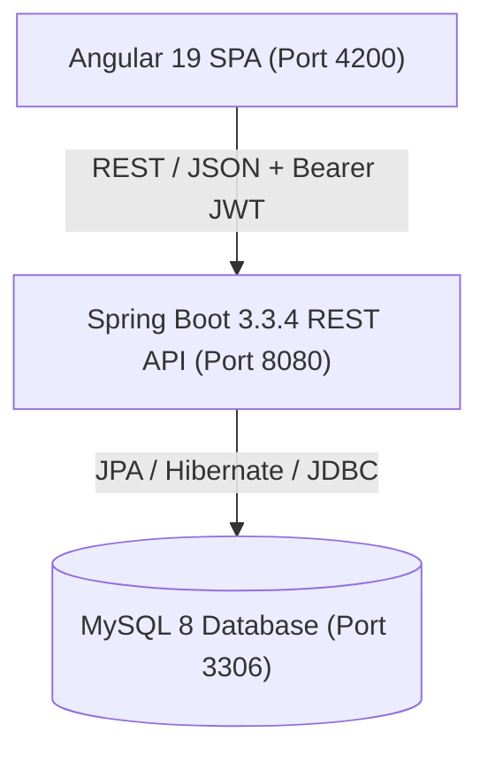

# PORTFOLIOPRO — Simulated Stock Trading & Portfolio Management

PORTFOLIOPRO is a full-stack, enterprise-grade simulated stock trading and portfolio management web application built as an intensive 4-day MVP. The platform enables users to research stocks, examine technical and fundamental indicators, maintain watchlists, execute simulated buy and sell orders, track portfolio holdings with mark-to-market valuations and cost basis, and assess diversification and concentration risks through an intuitive, dark-themed fintech dashboard.

> [!WARNING]
> **SIMULATION ONLY — NOT A REAL BROKERAGE PLATFORM**
>
> PORTFOLIOPRO is strictly a simulation and educational environment. It does **not** connect to real-world financial brokerages or stock exchanges, does **not** process real money or payments, and uses seeded deterministic market datasets. All technical indicators, risk indicators, and portfolio metrics are basic educational demonstrations and do not constitute financial advice.

---

## Table of Contents
1. [Project Overview](#project-overview)
2. [Key Features](#key-features)
3. [Technology Stack](#technology-stack)
4. [Architecture](#architecture)
5. [Folder Structure](#folder-structure)
6. [Database Schema & Seed Data](#database-schema--seed-data)
7. [Authentication & Security](#authentication--security)
8. [REST API Reference](#rest-api-reference)
9. [Running Locally](#running-locally)
10. [Demo Account & Walkthrough](#demo-account--walkthrough)
11. [Testing & Quality Assurance](#testing--quality-assurance)
12. [Explicit Platform Limitations](#explicit-platform-limitations)

---

## 1. Project Overview

Navigating stock investing requires understanding order execution, position sizing, cost basis accounting, technical charting, and portfolio diversification. PORTFOLIOPRO provides a risk-free sandbox environment where users can learn and practice these concepts without financial risk.

The application adheres to clean architecture principles:
- **Stateless backend** with Spring Boot 3 and JWT authentication.
- **Modern frontend** with Angular 19 standalone components, reactive forms, and SVG visualizations.
- **Relational data integrity** enforced via MySQL 8 with foreign key relationships and unique constraints.

---

## 2. Key Features

- **Authentication & User Management**: Secure user registration, BCrypt password hashing, and stateless JWT token-based authentication.
- **Market Catalog & Watchlist**: Browse 8 deterministic seeded stocks (AAPL, MSFT, GOOGL, AMZN, TSLA, NVDA, JPM, META), filter with real-time client-side search, view valuations, and bookmark items to a personal watchlist.
- **Technical Analysis**: Interactive 60-day SVG price chart with hover crosshairs, 20-day Simple Moving Average (MA20), 50-day Simple Moving Average (MA50), and 14-period Relative Strength Index (RSI-14).
- **Fundamental Analysis**: Key fundamental financial metrics including Market Capitalization, Earnings Per Share (EPS), Price-to-Earnings Ratio (P/E), and Sector classifications.
- **Simulated Trading Engine**:
  - Modal order execution for both `BUY` and `SELL` actions with stepper quantity controls and real-time order value calculation.
  - Automatic position tracking with weighted average buy price calculation for repeated purchases.
  - Position reduction or complete holding deletion on sales, with overdraft protection preventing short-selling.
- **Order Audit Trail**: Immutable transaction history capturing order IDs, trade types, timestamps, executed prices, and status.
- **Portfolio & Holdings Tracking**: Mark-to-market portfolio overview showing total invested capital, current valuation, dollar profit/loss ($), and percentage return (%).
- **Risk & Diversification Analytics**: Asset allocation breakdown (donut chart and progress bar), diversification rating (Low / Moderate / Higher), and concentration risk indicator (High / Moderate / Lower).
- **Fintech UI/UX**: Professional dark navy/charcoal styling (`#0b1120`, `#1e293b`), positive emerald (`#10b981`), negative crimson (`#ef4444`), responsive desktop and mobile navigation drawers.

---

## 3. Technology Stack

### Frontend
- **Framework**: Angular 19 (Standalone Components, modern `@if` / `@for` control flow)
- **Language**: TypeScript 5.5, HTML5, Modern CSS custom properties
- **State & HTTP**: Angular `HttpClient`, RxJS, `AuthInterceptor`, `AuthGuard`
- **Charts**: Custom interactive SVG components (Price Line Chart with Crosshairs, Donut Allocation Chart)

### Backend
- **Framework**: Spring Boot 3.3.4
- **Language**: Java 17+ (fully validated on Java 27)
- **Security**: Spring Security 6, JWT (`jjwt 0.11.5`), BCrypt password hashing
- **Persistence**: Spring Data JPA, Hibernate ORM
- **Validation**: Jakarta Bean Validation (`spring-boot-starter-validation`)
- **Testing**: JUnit 5, Mockito, Spring Boot Test, H2 In-Memory DB

### Database & Infrastructure
- **Database**: MySQL 8.x
- **Containerization**: Docker & Docker Compose

---

## 4. Architecture

PORTFOLIOPRO follows a 3-tier decoupled architecture:



For complete architectural specifications, sequence diagrams, and mathematical formulations, refer to [docs/ARCHITECTURE.md](file:///Users/samarthsingh/.gemini/antigravity/scratch/portfolio-pro/docs/ARCHITECTURE.md).

---

## 5. Folder Structure

```
portfolio-pro/
├── README.md                      # Primary project guide
├── docker-compose.yml             # Multi-container orchestration (MySQL, Backend, Frontend)
├── database/
│   ├── schema.sql                 # DDL definitions (tables, constraints, foreign keys)
│   └── seed.sql                   # Seed script (8 stocks, 60 days history, demo account)
├── docs/
│   ├── ARCHITECTURE.md            # Comprehensive system architecture & math formulas
│   ├── API.md                     # Complete REST API specification
│   ├── SETUP.md                   # Detailed local and Docker installation instructions
│   └── DEMO.md                    # Step-by-step 13-stage demo walkthrough
├── backend/
│   ├── pom.xml                    # Maven build configuration
│   └── src/
│       ├── main/java/com/portfoliopro/
│       │   ├── config/            # SecurityConfig, CorsConfig
│       │   ├── controller/        # REST Controllers (Auth, Market, Trade, Portfolio, Analysis)
│       │   ├── dto/               # Request & Response Data Transfer Objects
│       │   ├── entity/            # JPA Entities (User, Stock, Holding, Order, etc.)
│       │   ├── exception/         # GlobalExceptionHandler & custom exceptions
│       │   ├── repository/        # Spring Data JPA Repository interfaces
│       │   ├── security/          # JwtService, JwtAuthenticationFilter, UserDetails
│       │   └── service/           # Business logic & trading engine
│       └── test/                  # 29 automated unit and integration tests
└── frontend/
    ├── package.json               # Frontend dependencies & scripts
    ├── angular.json               # Angular CLI configuration
    └── src/
        ├── app/
        │   ├── core/              # AuthService, Interceptors, Guards
        │   ├── models/            # TypeScript interfaces
        │   ├── pages/             # Dashboard, Market, Stock Details, Portfolio, Orders, Analysis
        │   └── shared/            # Navbar, Sidebar, StatCard, TradeModal
        └── environments/          # Environment endpoints
```

---

## 6. Database Schema & Seed Data

The database schema is organized into 6 core relational entities:

| Table | Purpose | Key Constraints |
|---|---|---|
| `users` | User credentials and metadata | Unique `username`, unique `email` |
| `stocks` | Master stock catalog (8 companies) | Unique `symbol` |
| `price_history` | 60 days of historical daily close prices per stock | Foreign key `stock_id` $\rightarrow$ `stocks(id)` |
| `watchlist` | User bookmarked stocks | Unique composite `(user_id, stock_id)` |
| `orders` | Transaction ledger for BUY / SELL trades | Foreign keys to `users` and `stocks` |
| `holdings` | Aggregate position and weighted cost basis | Unique composite `(user_id, stock_id)` |

### Seeded Companies
The database comes pre-seeded with 8 popular equities:
- **AAPL** (Apple Inc. - Technology - $225.50)
- **MSFT** (Microsoft Corp. - Technology - $428.20)
- **GOOGL** (Alphabet Inc. - Technology - $178.60)
- **AMZN** (Amazon.com Inc. - Consumer Cyclical - $186.40)
- **TSLA** (Tesla Inc. - Consumer Cyclical - $242.10)
- **NVDA** (NVIDIA Corp. - Technology - $121.80)
- **JPM** (JPMorgan Chase & Co. - Financial Services - $208.90)
- **META** (Meta Platforms Inc. - Technology - $512.30)

---

## 7. Authentication & Security

- **Stateless JWT**: Upon login, a signed JSON Web Token is returned to the client and stored in `localStorage`.
- **Authorization Header**: Angular's `AuthInterceptor` automatically injects `Authorization: Bearer <token>` into all outgoing API requests.
- **Route Protection**: Angular's `AuthGuard` restricts access to `/dashboard`, `/market`, `/portfolio`, `/orders`, `/analysis`, and `/profile`.
- **Credential Protection**: Passwords are encrypted using Spring Security's `BCryptPasswordEncoder` with 10 rounds of salting. Passwords are never returned in API responses.

---

## 8. REST API Reference

| Method | Endpoint | Access | Description |
|---|---|---|---|
| `POST` | `/api/auth/register` | Public | Register new user account |
| `POST` | `/api/auth/login` | Public | Authenticate user and obtain JWT token |
| `GET` | `/api/users/profile` | Protected | Get authenticated user profile |
| `GET` | `/api/stocks` | Protected | List all available stocks |
| `GET` | `/api/stocks/{symbol}` | Protected | Retrieve details for a specific stock |
| `GET` | `/api/watchlist` | Protected | List authenticated user's watchlist |
| `POST` | `/api/watchlist/{stockId}` | Protected | Add stock to user's watchlist |
| `DELETE` | `/api/watchlist/{stockId}` | Protected | Remove stock from user's watchlist |
| `POST` | `/api/orders` | Protected | Place a simulated BUY or SELL order |
| `GET` | `/api/orders` | Protected | Retrieve user's order execution history |
| `GET` | `/api/portfolio` | Protected | Get holdings, invested value, current value, and P/L |
| `GET` | `/api/portfolio/summary` | Protected | Lightweight portfolio metric summary |
| `GET` | `/api/portfolio/analytics` | Protected | Asset allocation %, diversification, and risk indicator |
| `GET` | `/api/analysis/technical/{symbol}` | Protected | MA20, MA50, RSI-14, and 60-day price history |
| `GET` | `/api/analysis/fundamental/{symbol}` | Protected | Fundamental metrics (Market Cap, EPS, P/E, Sector) |

*For complete request/response JSON schemas, refer to [docs/API.md](file:///Users/samarthsingh/.gemini/antigravity/scratch/portfolio-pro/docs/API.md).*

---

## 9. Running Locally

### Quick Start:

1. **Database**:
   ```bash
   mysql -u root -p < database/schema.sql
   mysql -u root -p < database/seed.sql
   ```
2. **Backend**:
   ```bash
   cd backend
   mvn spring-boot:run
   ```
3. **Frontend**:
   ```bash
   cd frontend
   npm install
   npm start
   ```
4. Access the web interface at `http://localhost:4200`.

*For comprehensive prerequisites, Docker instructions, and troubleshooting tips, see [docs/SETUP.md](file:///Users/samarthsingh/.gemini/antigravity/scratch/portfolio-pro/docs/SETUP.md).*

---

## 10. Demo Account & Walkthrough

### Pre-Configured Demo Credentials:
- **Username**: `demo`
- **Password**: `demo123`

### Official Demo Sequence:
To experience the entire platform capability end-to-end, execute this sequence:

```
Login
  → Dashboard
  → Market
  → Search AAPL
  → Stock Details
  → Technical Analysis
  → Fundamental Analysis
  → Watchlist
  → Buy AAPL
  → Order History
  → Portfolio
  → P/L
  → Risk & Performance
```

*For the complete step-by-step walkthrough detailing expected screen states and API requests, see [docs/DEMO.md](file:///Users/samarthsingh/.gemini/antigravity/scratch/portfolio-pro/docs/DEMO.md).*

---

## 11. Testing & Quality Assurance

The codebase includes comprehensive automated test coverage for core business rules:

```bash
cd backend
mvn test
```

### Verified Test Suite (29 Tests Passing, 0 Failures):
- **`AuthAndUserControllerTest`**: Authentication registration, duplicate validation, login, JWT issuance, profile retrieval.
- **`AuthServiceTest`**: Password hashing, token generation, user existence validation.
- **`MarketAndWatchlistServiceTest`**: Stock catalog retrieval, watchlist addition, duplicate rejection, deletion.
- **`TradeServiceTest`**:
  - BUY order on new position sets initial quantity and cost basis.
  - BUY order on existing position recalculates weighted average purchase price.
  - SELL order reduces existing holding.
  - SELL order of entire position deletes holding record.
  - SELL order exceeding current position throws 400 Bad Request error.
- **`PortfolioServiceTest`**: Mark-to-market calculations, invested value, profit/loss dollar and percentage arithmetic.
- **`AnalysisServiceTest`**: MA20, MA50, 14-period Wilder-smoothed RSI, asset allocation percentages, diversification indicators, and concentration risk metrics.

---

## 12. Explicit Platform Limitations

PORTFOLIOPRO was intentionally architected as a prototype MVP. Users and evaluators should note the following constraints:

1. **Simulated Trading Only**: Orders are executed instantly in a local database sandbox; no interaction with live markets, order matching books, exchange clearinghouses, or brokerages exists.
2. **Seeded / Mock Market Data**: All prices, sector classifications, and historical quotes are deterministic mock data. No real-time market API (e.g. Yahoo Finance, AlphaVantage) is utilized.
3. **No Real Brokerage**: The application does not interface with interactive brokers, FIX protocol gateways, or SEC/FINRA regulated entities.
4. **No Real Money**: No bank account transfers, fiat currency deposits, or real monetary balances are supported.
5. **Basic Analytics**: Performance metrics reflect basic accounting calculations (unrealized mark-to-market) rather than time-weighted (TWR) or money-weighted (MWR) returns.
6. **Basic Technical Indicators**: Moving averages and RSI use daily closing values without intraday bar sampling, volume weighting, or slippage models.
7. **Basic Risk Indicator**: Concentration risk and diversification ratings are calculated using simple holding count thresholds for demonstration and educational purposes only.

> [!CAUTION]
> **Do not describe or present this application as a real brokerage platform.** It is intended strictly for education, demonstration, and software engineering evaluation.
