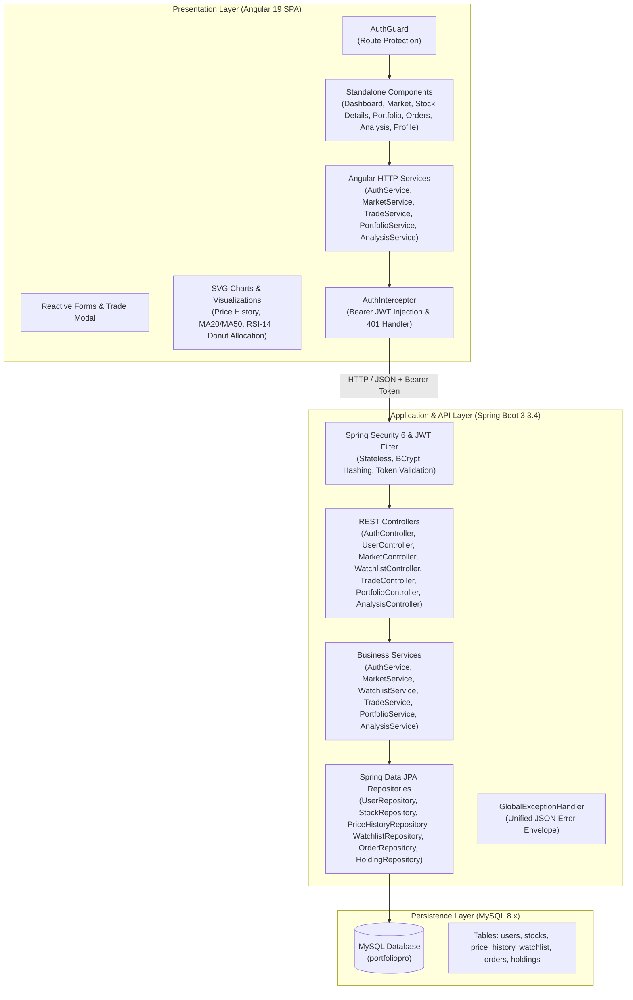
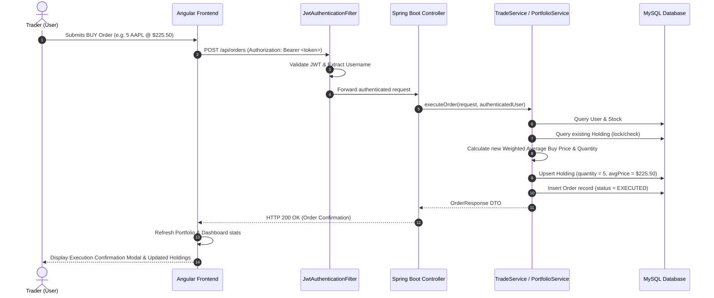
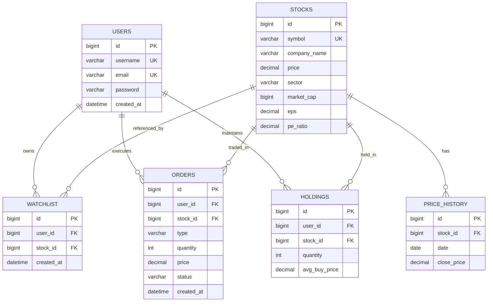

# PORTFOLIOPRO System Architecture

## 1. System Overview

**PORTFOLIOPRO** is an enterprise-grade full-stack simulated stock trading and portfolio management web application designed as a 4-day Minimum Viable Product (MVP). The platform enables users to explore mock market data, conduct technical and fundamental stock analysis, maintain a personal watchlist, execute simulated market buy and sell orders, track cost basis and unrealized profit/loss, and evaluate portfolio diversification and concentration risks.

> [!IMPORTANT]
> **Educational & Simulation Disclaimer:** PORTFOLIOPRO is strictly a simulation environment. It does not interface with financial brokerages, does not handle real currency, and uses seeded deterministic market datasets. All analytics, technical indicators, and risk metrics are educational representations and do not constitute financial advice.

---

## 2. High-Level Architecture Diagram



---

## 3. End-to-End Request & Data Flow



---

## 4. Frontend Architecture (Angular 19)

The client application is built using modern Angular 19 leveraging standalone components, direct control flow (`@if`, `@for`), and a modular service layer.

### 4.1 Component Tree & Responsibilities

| Component | Route | Responsibility |
|---|---|---|
| `NavbarComponent` | Global Header | Branding, responsive navigation links, authenticated user indicator, and logout trigger |
| `LoginComponent` | `/login` | User authentication form, error handling, token persistence |
| `RegisterComponent` | `/register` | New user account creation, client-side validation |
| `DashboardComponent` | `/dashboard` | Executive overview: live portfolio stats, market leaders, user watchlist, recent orders, quick actions |
| `MarketComponent` | `/market` | Complete catalog of 8 seeded stocks with real-time search filtering, prices, sector tags, and action shortcuts |
| `StockDetailsComponent` | `/market/:symbol` | Deep-dive stock view: fundamentals (EPS, P/E, Market Cap), interactive SVG price chart with MA20 & MA50 overlays, RSI-14 oscillator, watchlist toggle, and trade launcher |
| `TradeFormComponent` | Modal Overlay | Reusable order placement modal for BUY and SELL orders with real-time total calculation, stepper quantity controls, and balance validation |
| `PortfolioComponent` | `/portfolio` | Mark-to-market portfolio summary cards and detailed holdings table with dynamic profit/loss coloring |
| `OrdersComponent` | `/orders` | Complete transaction history table showing order ID, type (BUY/SELL), symbol, quantity, execution price, total value, status, and timestamp |
| `AnalysisComponent` | `/analysis` | Portfolio analytics view: interactive SVG Donut Chart, multi-asset allocation bars, diversification rating, and concentration risk indicator |
| `ProfileComponent` | `/profile` | Authenticated user account summary and session management |

### 4.2 Security & Interceptors
- **`AuthGuard`**: Intercepts route navigation. If the user does not possess a valid token in `localStorage`, navigation is canceled and redirected to `/login`.
- **`AuthInterceptor`**: Clones every outgoing HTTP request to append `Authorization: Bearer <token>`. Catches `401 Unauthorized` responses to clear local storage and force a logout.

### 4.3 Visual Design System
- **Theme**: Fintech Dark Navy / Charcoal palette.
  - Background Base: `#0b1120`
  - Elevated Cards: `#1e293b` (border: `rgba(255, 255, 255, 0.08)`)
  - Primary Accent: Royal Blue (`#2563eb`, `#38bdf8`)
  - Profit / Positive: Emerald Green (`#10b981`)
  - Loss / Negative: Crimson Red (`#ef4444`)
  - Text: High-contrast Slate (`#f8fafc` primary, `#94a3b8` muted)

---

## 5. Backend Architecture (Spring Boot 3.3.4)

The backend is built with Spring Boot 3.3.4 on Java 17+ (tested through Java 27) following clean layered architecture.

```
com.portfoliopro
├── config/              # SecurityConfig, CorsConfig
├── controller/          # REST Controllers
├── dto/                 # Request and Response transfer objects
├── entity/              # JPA entity classes
├── exception/           # GlobalExceptionHandler & custom exception classes
├── repository/          # Spring Data JPA interfaces
├── security/           # JwtService, JwtAuthenticationFilter, CustomUserDetailsService
└── service/             # Business logic interfaces and implementations
```

### 5.1 Layer Breakdown

1. **REST Controller Layer**: Maps HTTP requests to service calls, enforces bean validation (`@Valid`), and returns ResponseEntity envelopes.
2. **Business Service Layer**: Encapsulates core trading rules, weighted average pricing, technical indicator math (MA20, MA50, RSI-14), portfolio mark-to-market, and risk concentration calculations.
3. **Security Layer**:
   - `JwtAuthenticationFilter`: Extracts JWT from `Authorization` header, validates signature and expiration, and establishes `SecurityContextHolder` authentication.
   - `SecurityConfig`: Configures CORS, disables CSRF (stateless API), establishes public endpoints (`/api/auth/**`), and secures all business routes (`/api/**`).
   - `BCryptPasswordEncoder`: 10-round salted hashing for stored credentials.
4. **Data Access Layer**: Spring Data JPA repositories with derived and JPQL queries for optimized performance.
5. **Exception Handling**: `@RestControllerAdvice` (`GlobalExceptionHandler`) intercepts validation errors, duplicate usernames/emails, insufficient shares for sale, and entity not found errors, serializing them into standard JSON error objects.

---

## 6. Database Schema & Entity Relationships



---

## 7. Mathematical Formulations & Algorithms

### 7.1 Weighted Average Cost Basis (Order Execution)

When a BUY order is executed:
- **First-time holding:**
  $$\text{Quantity} = Q_{\text{order}}, \quad \text{AvgBuyPrice} = P_{\text{order}}$$
- **Existing holding:**
  $$Q_{\text{new}} = Q_{\text{old}} + Q_{\text{order}}$$
  $$\text{AvgBuyPrice}_{\text{new}} = \frac{(Q_{\text{old}} \times \text{AvgBuyPrice}_{\text{old}}) + (Q_{\text{order}} \times P_{\text{order}})}{Q_{\text{new}}}$$

When a SELL order is executed:
- Validation: $Q_{\text{order}} \le Q_{\text{old}}$ (otherwise HTTP 400 Bad Request).
- If $Q_{\text{order}} = Q_{\text{old}}$, the holding record is deleted.
- If $Q_{\text{order}} < Q_{\text{old}}$, $Q_{\text{new}} = Q_{\text{old}} - Q_{\text{order}}$ and $\text{AvgBuyPrice}$ remains unchanged.

### 7.2 Portfolio Mark-to-Market Valuation & Returns

For holding $i$ with quantity $Q_i$, average purchase price $P_{\text{avg}, i}$, and current market price $P_{\text{curr}, i}$:
$$\text{InvestedValue}_i = Q_i \times P_{\text{avg}, i}$$
$$\text{CurrentValue}_i = Q_i \times P_{\text{curr}, i}$$
$$\text{ProfitLoss}_i = \text{CurrentValue}_i - \text{InvestedValue}_i$$
$$\text{ProfitLossPercent}_i = \begin{cases} \left(\frac{\text{ProfitLoss}_i}{\text{InvestedValue}_i}\right) \times 100 & \text{if } \text{InvestedValue}_i > 0 \\ 0 & \text{otherwise} \end{cases}$$

For the aggregate portfolio:
$$\text{TotalInvested} = \sum_{i=1}^{N} \text{InvestedValue}_i, \quad \text{TotalCurrentValue} = \sum_{i=1}^{N} \text{CurrentValue}_i$$
$$\text{TotalProfitLoss} = \text{TotalCurrentValue} - \text{TotalInvested}$$
$$\text{TotalProfitLossPercent} = \begin{cases} \left(\frac{\text{TotalProfitLoss}}{\text{TotalInvested}}\right) \times 100 & \text{if } \text{TotalInvested} > 0 \\ 0 & \text{otherwise} \end{cases}$$

### 7.3 Technical Indicators

#### Simple Moving Averages (MA20 & MA50)
For closing prices $\{C_1, C_2, \dots, C_K\}$ ordered by date ascending where $C_K$ is the most recent:
$$\text{MA20} = \frac{1}{20} \sum_{j=0}^{19} C_{K-j}, \quad \text{MA50} = \frac{1}{50} \sum_{j=0}^{49} C_{K-j}$$
*(Returns `null` if fewer than 20 or 50 records exist).*

#### Relative Strength Index (RSI-14)
Using 14 daily price changes:
$$\Delta C_t = C_t - C_{t-1}$$
$$\text{Gain}_t = \max(\Delta C_t, 0), \quad \text{Loss}_t = \max(-\Delta C_t, 0)$$
Initial 14-day average:
$$\text{AvgGain}_0 = \frac{1}{14} \sum_{t=1}^{14} \text{Gain}_t, \quad \text{AvgLoss}_0 = \frac{1}{14} \sum_{t=1}^{14} \text{Loss}_t$$
Wilder's smoothing for subsequent periods $t$:
$$\text{AvgGain}_t = \frac{(\text{AvgGain}_{t-1} \times 13) + \text{Gain}_t}{14}, \quad \text{AvgLoss}_t = \frac{(\text{AvgLoss}_{t-1} \times 13) + \text{Loss}_t}{14}$$
$$\text{RS} = \frac{\text{AvgGain}}{\text{AvgLoss}}, \quad \text{RSI}_{14} = 100 - \left(\frac{100}{1 + \text{RS}}\right)$$

### 7.4 Risk & Diversification Analytics

1. **Asset Allocation Percentage**:
   $$\text{Allocation}_i = \left(\frac{\text{CurrentValue}_i}{\text{TotalCurrentValue}}\right) \times 100$$
2. **Diversification Indicator**:
   - $N = 1$: `"Low Diversification"`
   - $2 \le N \le 3$: `"Moderate Diversification"`
   - $N \ge 4$: `"Higher Diversification"`
3. **Risk Concentration Indicator**:
   - $N = 1$: `"High Concentration"`
   - $2 \le N \le 3$: `"Moderate Concentration"`
   - $N \ge 4$: `"Lower Concentration"`

---

## 8. Architectural Limitations

1. **Deterministic Mock Data**: Price histories and fundamental metrics are populated deterministically. No live market WebSocket feeds or FIX protocol connections are used.
2. **Simulated Execution**: Orders execute synchronously at quoted market prices without order books, partial fills, slippage, or exchange transaction fees.
3. **No Financial Advisory**: Diversification and concentration indicators use simple heuristic asset counts intended solely for demonstrative purposes.
